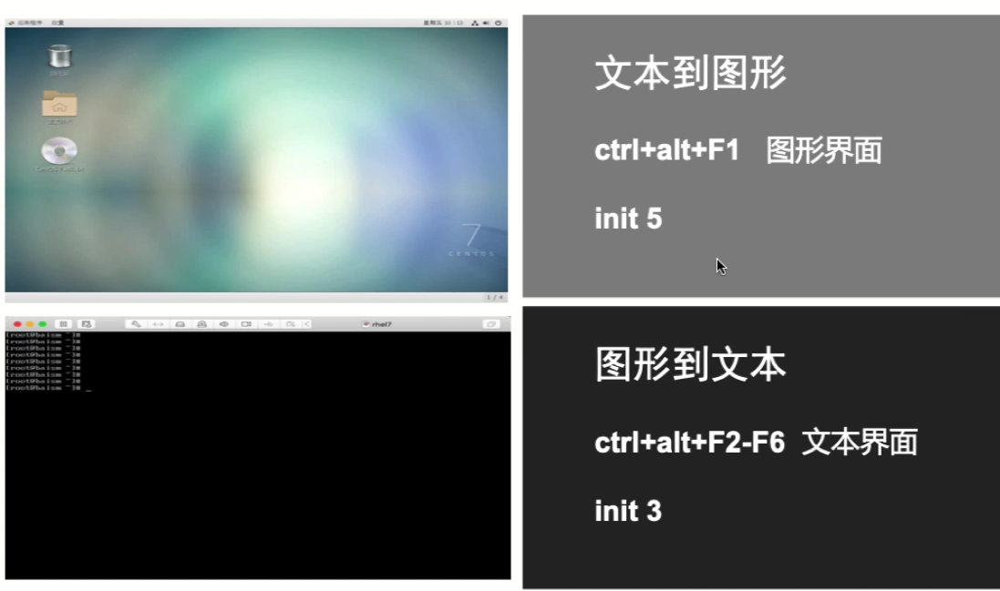
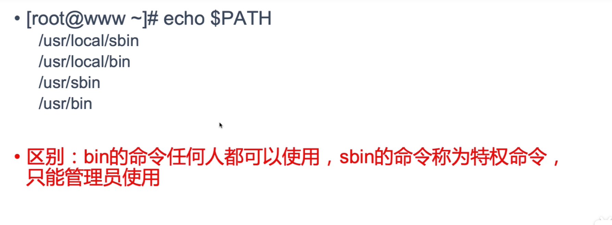
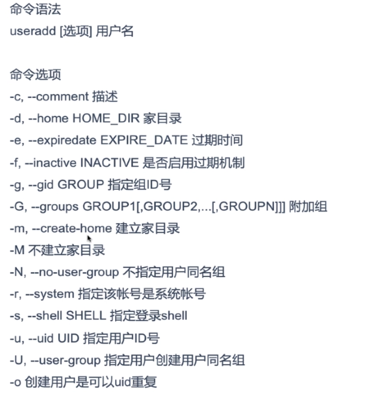
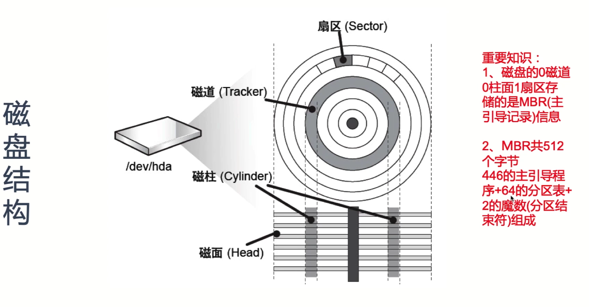
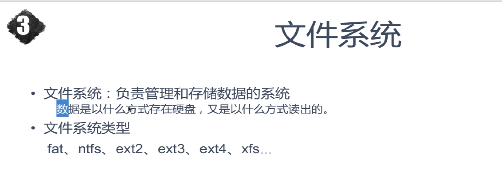
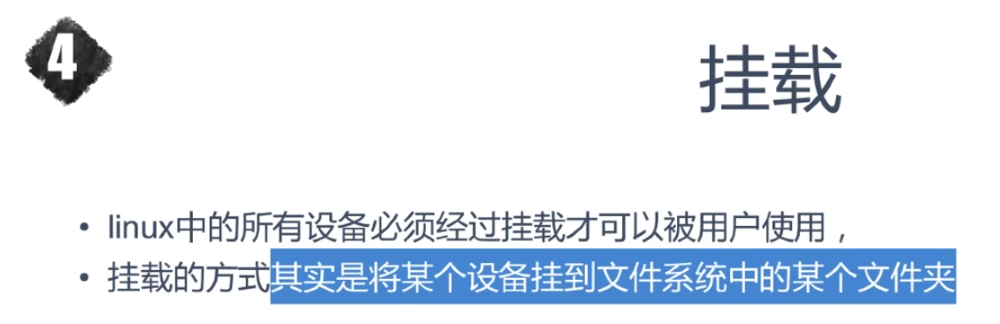
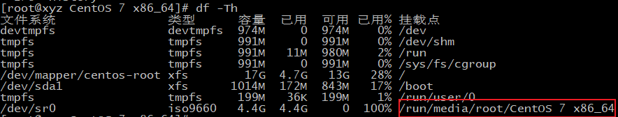

# 1.Linux

学习相关连接 

> 文档 : https://www.zutuanxue.com/home/4/2_2
>
> 视频:  https://www.bilibili.com/video/BV1xK4y1x7D9/?p=17&spm_id_from=pageDriver&vd_source=fd2d9d3797ff10e34f09ae921fe12728

> 一款开源的操作系统(os)

- fdisk -l = 查看硬盘
- df = 查看分区使用情况 (挂在的 -Th)
- du = 查看磁盘文件
- free = 查看内存
- lscpu = 查看cpu信息
- netstat -ntpl = 查看打开的端口

### 1.1. 什么是操作系统(operation System)

操作系统就是用来 

1. 管理硬件
2. 驱动硬件
3. 管理软件
4. 分配资源

市面上常见的os 有 移动端的 andrid,ios 等

pc 端有 mac , window, linux等

> 我们通过 qq (application) 发送一条信息给 朋友 ("hi") , application (安装在操作系统里) 通过代码 发布指令给硬件 (cpu,内存,网卡)
>
> 转换成二进制 通过网卡发送到 朋友的 qq里.
>
> 我们手机里 可能会有 qq , 微信 等软件.当同时用两个或者多个软件是 合理的分配资源.


### 2.2. linux 起源

最开始的计算机是批量操作的

> 你想要对计算机下达命令只能一次性写入全部程序,错了只能排查重新输入,无法交互,你在使用时别人无法使用
>
> 比如 你给明天的自己安排任务,明天做什么只能在今天安排好,无论发生什么事都不能改变
>
> 嘿 没有 起床 刷牙 ,上厕所,吃饭 ,上学.如果你在吃好饭才想上厕所就只能重新 起床,刷牙,吃饭,上厕所.无法中途修改

然后 就有两个人发明了 可以 交互,独立,可以本地测试的系统 uninx

uninx 开源给所有人使用 之后改为 付费

这时候 理查德.斯托曼 创办了gnu 开源之父.各个精英投奔 ,再加上上gpl 基金会

开发了很多软件 GCC ...

但是没有自己的内核

一个计算机 要有 显示页面,shell , 内核

此时 linus torvalds 通过minux基础开发了 内核 

理查德 请了 linus 后 将 gnu 改为 linux(开源的系统 , 任何人都可以使用, 修改, 发行自己的版本)

后来 也就有了 redhead 的 centos (开源), ubuntu, solaris 等

# 2. VMware(虚拟机)

为了学习必须安装虚拟机,因为把自己的电脑改成linux和买服务器(阿里云,亚马逊云)费钱

Vmware 的优势


### 2.1. vmware 安装

在window上只需要下载然后点击下一步 

下载地址:

https://www.vmware.com/latam/products/workstation-pro/workstation-pro-evaluation.html

- 点击创建
- 根据自己所需 cpu , 内存 , 磁盘 (4 , 2 GB, 20 GB)

磁盘

/boot  : 启动文件 100m 左右

/swap : 内存空间 (物理磁盘满后备用) 4096m

/ :其他根目录

然后 给虚拟机安装vm ware tools :左上角 vm 下面




### 2.2图形界面

有两种形式 图形和 文本

图形 (ctl + alt + f2)  : enome 和 kde

安装kde 

```
yum grouplist
yum install ""
```

文本 (ctl + alt + f3)

# 3. Linux 基础

### 3.1. 设计思想


- 文件要小 而且 有用
- 可移植性强 (shell , perl, python)
- 用文件储存
- 让程序员配合其他工具一起使用
- 减少 交互,一切配置自动 设置

### 3.2. 目录介绍


- dev
- boot
- lib
- media
- tmp
- mnt
- var
- srv
- sys
- opt
- home
- root
- run
- etc

### 3.3. linux 命令


ls -a /tmp

rm -rf ./*

当我们输入命令后 命令会通过 内部和外部 执行

用 type 查看 

type ls

type clear 



#### 3.3.1. 常用命令


- clear
- man (man cd)
- cd
- ls -ald
- hostname
- date (date +%F)
- cal (cal 1999)
- bc (计算小数点   scale=2)
- reboot shuutdown -r init 5
- logout
- halt shutdown -h init 0
- uname (uname -a)
- pwd

# 4.文件

### 4.1. 文件创建

- touch [命令选项] [参数]


touch 123

可以用 stat 123 查看 文件的 信息

文件 用inode 和 块 储存 默认 4096


### 4.2. 删除 (rm)

大多数情况使用 rm -f


### 4.3. 更改

mv [旧文件名] [新文件名]

mv 123 456

### 4.4. 查看

ls -al 


### 4.5. 移动


### 4.6. 拷贝


### 4.7. 查看文件内容

有3个 

- cat
- head
- tail

#### 4.7.cat.


cat -n 显示行数

cat -b 显示行数 , 但是空格行 会跳过

#### 4.7.2.head


4.7.3. tail


tail -n +5 从第五行打印到最后

### 4.8. 文件夹管理

新建 - mkdir


删除 - rmdir


# 5.vim

### 5.1. vim

文本编辑器:

想要编辑linux里的文件 必须使用.window 里 默认 txt

linux 默认 vi . vim(virtual interface IMproved) 类似 world 功能跟多

vim使用命令 编辑 


### 5.2. vim使用

vim [文件名]

进去之后在低下会显示 文件的信息


hkjl 和 上下左右 移动光标

home 和 end 最前和最后

gg 文件的开始 G 文件最后

w 一个单词

dd 删除 一行 

ndd  删除 n行 

dw 删除一个单词

a 或 i 或 o 插入模式 可以更改

按esc /abc 查找 abc

u 回复 (类似 ctl + z)

### 5.3. 末行模式

vim 文件后呢 进入按 shift + : 进入

:q 退出

:w  保存

:wq 保存退出

替换模式


vim 后 显示 行数

!ls / 编辑时不需要退出 


在vim ~/.vimrc 里面 写 set nu 等个人设置

编辑多个文件

touch a b

vim a b

:n 进入 下一个文件

:N 进入 上一个文件

# 6.用户和数组

### 6.1. 简介

linux 里有三种用户 root 管理员 系统用户(UID 小于 1000) 和 普通用户(UID 大于 1000 只能使用 bin下的文件)

组就是用来装用户的 根据文件来设定权限

## 1.用户

### 6.2. 新建用户



练习 新增用户


```
 useradd -u 1500 -G root -d /tmp/user01 -s /bin/bash -c "test user01" user01
 
 useradd -r -M -s /sbin/nologin user02
 
 useradd -e 2019-04-01 -f 3 user03
 
 useradd -o -u 0 -g 0 user04
```

切换用户

su - user01 

su - user02

### 6.3. 设置密码

passwd user01 (交互式设置)

echo "123"|passwd --stdin user01 (无交互式)

su - user01 之后 passwd 更改密码

passwd -l user 01 锁定密码 

passwd -u user01

passwd -d user01

passwd -S user01


### 6.4. 修改用户

#### 1.usermod 

更改用户的家目录

usermod -m -d /home/user01 user01

更改 用户组

usermod -G root -a user01 


#### 2. 更改用户密码


用户 密码权限

chage user01

change -m 10 -M 365 -W 5 -I 4 -E 2022-10-10 user01

查看

passwd -S

### 6.5. 密码文件

vim /etc/passwd

vim /etc/shadow


## 2.组

### 6.6.创建组

groupadd admin

groupadd -g 1555 admin

添加 admin 组


#### 6.7. 修改组信息

groupmod -n ADMIN admin


### 6.8. 删除

groupdel -d admin


### 6.9.组密码

组的信息存在/etc/group

添加密码

gpasswd admin

添加组管理员 / 组长

gpasswd -A  user01 admin


## 3.添加用户和组流程

useradd user01 后保存到 /etc/passwd 和 /etc/shadow 中 组 也保存在 group 和 gshadow .

家目录 从 /etc/skel/ 拷贝来

/etc/default/useradd 和 /etc/login.defs 是默认 配置文件


# 7.权限

权限就是用来约束用户和组的.

对文件而言 (读写执行)三种权限

可以指定权限给(拥有者/组成员/其他人)

## 7.1.普通权限

### 7.1.1. 连接


前三个是 普通文件 读写/读/读 连接 拥有者 组 

连接是 1 只有这个文件 没有连接


ln -s 是软连接

ln 硬链接后 连接变 2

### 7.1.2. chmod

给文件权限

chmod u+x,g+wx,o+wx a

 chmod u-x,g-wx,o-wx a

chmod u=r,g=r,o=r a

chmod -R u=rwx aaa

数字

r = 4

w = 2

x = 1

chmod 644 a


### 7.1.3. chown

chown user01 a

用户和名一起改

chown user01.admin a


### 7.1.3.chgrp

chgrp root a

chgrp -R aaa


## 7.2. 特殊权限


chmod 4755 后 所有用户都会以root的身份执行文件(拥有 你爸爸的权力)

chmod 2755 文件夹后 里面创建的文件都会 和文件夹一样 (只有 你爸爸的特点 )

chmod 1755 只有拥有者可以删

## 7.3.Acl 权限

access control list 

用来给特殊 用户的权限 (比如任何人都可以喝你的水 , 除了他以外)

getfacl a

setfacl -m user:user01:rwx a

setfacl -m group:admin:rwx a

setfacl -k user01 a


## 7.4. 隐藏权限


# 8.磁盘

磁盘 2 种 : 机械 和固态

机械 如下图 像 黑胶唱片一样




磁盘存在 /dev/hda1 


## 8.1. 磁盘分区

fdisk -l


/dev/sda1  硬盘硬件位置 (sd solid drive )

*=启动位置

2048 = 硬盘 开始储存的 位置 2099>>> 结束位置  

inode 是存储 元数据  blocks 是 储存文件位置 

id 83 储存工具

sdb = 第二个硬盘分区

sdc = 第三个 硬盘分区


磁盘分为 主盘 (c 盘)和 扩展盘(D盘)

fdisk /dev/sda

n - 新建 p- 主(设置位置)

n- 新建 e- 扩展 

之后新建都是 logic 硬盘

## 8.2. 格式化

格式化 就是 把数据换成 一种格式 储存

雇了一个 仓库管理员 管理货物 




mkfs -t exts4 /dev/sdb1

mkfs -t ext3 /dev/sdb4

mkfs -t  xfs /dev/sdb5

mkswap /dev/sdb6

blkid 查看(磁盘)UID

## 8.3.挂在

把格式化的 文件挂载到 运行 文件




mount -t ext4 /dev/sdb1 /opt/data1

mount /dev/sdb6 /opt/data2


umount /opt/data1

umount /dev/sdb6


在 vim /etc/fstab 里面

 14 /dev/sdb1 /opt/data1 ext4 defaults 0 0
 15 /dev/sdb6 /opt/data2 xfs rw 0 0

 17 /dev/sdb7 swap                    swap    defaults        0 0

mount -a

swapon -a

df -Th 查看磁盘分区

du /opt/data1/s

# 9.软件包

软件包 有 rpm 安装 , yum 安装, 源码安装

推荐 源码安装

rpm 安装 不安全

## 9.1.rpm


rpm -ivh 安装的包

rpm -qa  查看所有包

rpm -e 卸载包





## 9.2.yum

解决了rpm 的依赖问题

只需要 yum http 就可以了.依赖自己安装


file - 本地连接 yum

其他 - 远程连接

### ftp连接 (sever)

1. 准备 rpm包
2. 安装vsftpd
3. 启动 systemctl start vsftpd
4. rpm 包挂在到 mount /dev/cdrom /var/ftp/pub/
5. 在浏览器 ftp://localhost/pub 就可以下载了

ftp(client)

cd /etc/yum.repos.d

mkdir repo_back

mv ./* ./repo_back

vim dvd.repo

[ftp]

name=test

baseurl=ftp://localhost/pub

gpgcheck=0

然后就可以通过 自己的yum 源下载了

yum源有

epel/ 清华/ 阿里等...

### yum命令

yum 的配置文件在 /etc/yum.cnf

```
 1 [main]
  2 cachedir=/var/cache/yum/$basearch/$releasever
  3 keepcache=0
  4 debuglevel=2
  5 logfile=/var/log/yum.log
  6 exactarch=1
  7 obsoletes=1
  8 gpgcheck=1
  9 plugins=1
 10 installonly_limit=5
 11 bugtracker_url=http://bugs.centos.org/set_project.php?project_id=23&ref=http://bugs.centos.org/bug_report_page.php?category=yum
 12 distroverpkg=centos-release
```

yum 之后rpm 包安装在 /var/cache/yum  /x86_64/ 下 /7

keepcache=0 是安装后删除 1 不删除

logfile = 日志文件

yum

install 安装

remove 删除

search 查找

update 更新

grouplist

groupinstall

groupremove

localinstall

### 源码安装

先到官网下载 tar.gz 

wget http:...

然后tar -zxvf 解压

查看里面有没有redme 或 INSTALL进行安装

./configure

make

没出现error就ok

make install


启动

cd /user/local/nginx

./sbin/nginx

# 10.Linux 服务


 

## 10.1.独立进程


## 10.2. 非独立进程


部署一个非独立服务

yum install -y telnet-server telnet xinetd

cd /etc/xinetd.d

vim telnet

```shell
service telnet
{
flags=REUSE
socket_type=stream
wait=no
user=root
server=/usr/sbin/in.telnetd
log_on_failure += USERID
disable=no
}
```

systemctl start xinetd

netstat -ntpl


# 11.进程


## 11.1.进程命令


### ps

ps aux

ps -ef


### top

top

按 s 1 (1秒刷新 默认3秒)

1 (cpu 情况)

u (查看 user01 的使用情况)


### 优先级

nice 和 renice

设置优先级 nice -n 8 ping localhost

修改优先级 renice -n 11 {进程id}

修改用户优先级 renice -n 5 -u root


# 12.网络

ifconfig

ip addr show

什么是 ip

ip就是 计算机的地址 

有掩码 和 网关

掩码 是 标识IP位和网络位

网关 是 IP的出口 


## 12.1.nmtui

图形界面 配置网卡

在 linux 中添加网卡

nmtui 进行配置

设置名字 , 和ip地址


## 12.2. nmcli

nmcli 用来操作 networkmanager 的(命令模式)

nmcli (TAB 键查看选项)

```
    1  history
    2  nmcli radio all off
    3  nmcli general 
    4  nmcli radio all on
    5  nmcli general 
    6  nmcli general hostname 
    7  nmcli general status 
    8  nmcli general permissions 
    9  cat /etc/hostname 
   10  vim /etc/hostname 
   11  yum install vim
   12  ls
   13  vim /etc/hostname 
   14  nmcli general hostname 
   15  cat /etc/hostname 
   16  nmcli general hostname 
   17  cat /etc/hostname 
   18  nmcli general hostname 
   19  nmcli general hostname www.hanfei
   20  nmcli general hostname 
   21  cat /etc/hostname 
   22  nmcli general logging 
   23  joournalctl -u NetworkManager
   24  journalctl -u NetworkManager
   25  nmcli device disconnect etho
   26  nmcli device disconnect eth1
   27* ip add sh
   28  nmcli device disconnect ens35
   29  nmcli device connect ens35
```


```
    1  nmcli connection show
    2  nmcli device connect eth2
    3  ip add show
    4  nmcli device connect ens36
    5  ip add show
    6  nmcli connection modify eth2 ipv4.addresses 192.168.3.200
    7  nmcli connection reload 
    8  ip add show
    9  nmcli connection load /etc/sysconfig/network-scripts/ifcfg-eth2
```

网卡配种文件 = /etc/sysconfig/network-scripts/

dns配置文件 = /etc/resolv.conf

主机 = /etc/hostname


